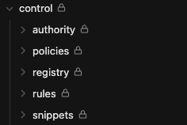

# Lock Your Folders & Notes

> 🧪 **Public beta.** This plugin is in active testing. If you hit something unexpected, please [submit an issue on GitHub](https://github.com/LeviathanDuck/Obsidian-Lock-Your-Folders-And-Notes/issues) — thanks for helping make it better.

An Obsidian plugin that protects folders and individual notes from accidental editing or renaming. 

It locks the notes you select into reader view only, until you force unlock. 

This plugin is designed to work inside obsidian alone, and your files are still always editable at their source with other tools. The lock only exists inside of the Obsidian itself. 

Other plugins and tools will be able to override this, it is primarily to prevent accidental human changes to notes you want to lock from changes. 

## Features

- **Force read mode** on locked folders (cascades to every file inside, at any depth) or individual locked notes.
- **Unlock exceptions** — carve out specific folders or notes inside a locked folder so they stay editable. Priority order: explicit note lock → unlock exception → folder lock.
- **Smart subfolder preview** — each locked-folder row in settings shows `↳ N subfolders, M files will be affected` so you can see the lock's reach before committing.
- **Block rename** (optional, experimental, default off) — rename attempts on locked folders/notes are reverted with a notice.
- **Force-unlock command with optional password** — escape hatch for when you really need to edit a locked note. Session-scoped (clears on plugin reload). Optional password is stored as a SHA-256 hash in `data.json`. Password reset button is no-password-required.
- **Configurable lock icon** in the file explorer:
  - Toggle on/off
  - Optional accent color
  - Position (before or after the name) — independent toggles for folders and notes
  - Works with default file explorer and Notebook Navigator
- **Three ways to add a lock**:
  1. Settings tab → dynamic list with folder/file suggestions (works identically on desktop and mobile)
  2. Right-click (desktop) or long-press (mobile) any folder or note in the **default file explorer** → **Lock** / **Unlock**
  3. Right-click a path inside a locked folder → **Add unlock exception (allow edit)**

> **Note on Notebook Navigator.** Right-click lock/unlock is not available from inside Notebook Navigator's pane. NN builds its own context menu internally and does not dispatch Obsidian's `workspace.file-menu` event that this plugin subscribes to. Lock icons **do** render correctly on NN rows — only the right-click menu is affected. To lock/unlock from an NN-centric workflow, use the **settings tab** (with path suggestions) or the **Command palette** (`Toggle global lock enforcement`, `Force unlock current note`). A tracker-issue or upstream PR to NN is the clean long-term path.
- **Global toggle command** — temporarily disable all locks when you need to edit
- **Import from Force Read Mode** — on first run, existing `force-read-mode/data.json` is imported automatically

## Installation

### Via BRAT (recommended)
1. Install the [Obsidian42 BRAT](https://github.com/TfTHacker/obsidian42-brat) plugin.
2. In BRAT settings, add this repository: `LeviathanDuck/Obsidian-Lock-Your-Folders-And-Notes`
3. Enable the plugin in Settings → Community Plugins.

### Manual
1. Download `main.js`, `manifest.json`, and `styles.css` from the latest release.
2. Place them in `your-vault/.obsidian/plugins/lock-your-folders-and-notes/`.
3. Enable in Settings → Community Plugins.

## Safety

- **Never modifies Obsidian's source.** All state lives in the plugin's `data.json`.
- **Theme-safe CSS** — all selectors are scoped to `[data-path=...]` attributes. No theme variables are overridden. `!important` is used only on SVG mask properties (required for cross-theme reliability).
- **Clean uninstall** — disabling or removing the plugin immediately removes all injected CSS, body classes, and event listeners.

## Acknowledgements

- Lock enforcement logic adapted from [Force Read Mode](https://github.com/al3xw/force-read-mode) by al3xw, MIT License.
- Lock icon from the [Lucide](https://lucide.dev) icon library, ISC License.

## Roadmap

Open ideas for future versions:

- **Frontmatter opt-in** — let a note declare `lyfn-locked: true` in YAML as an alternative to listing it in settings.
- **Canvas file support** — currently only `.md` files are protected; `.canvas` and other file types pass through untouched.

Have another request or bug report? [Open an issue on GitHub](https://github.com/LeviathanDuck/Obsidian-Lock-Your-Folders-And-Notes/issues).

## License

MIT. See [LICENSE](./LICENSE).

---

## Author

  

  Built by <a href="https://github.com/LeviathanDuck">Leviathan Duck</a> — Leftcoast Media House Inc. 
  Licensed under <a href="./LICENSE">MIT</a>. 
  <a href="https://github.com/LeviathanDuck?tab=repositories">More Obsidian plugins &amp; themes</a>

